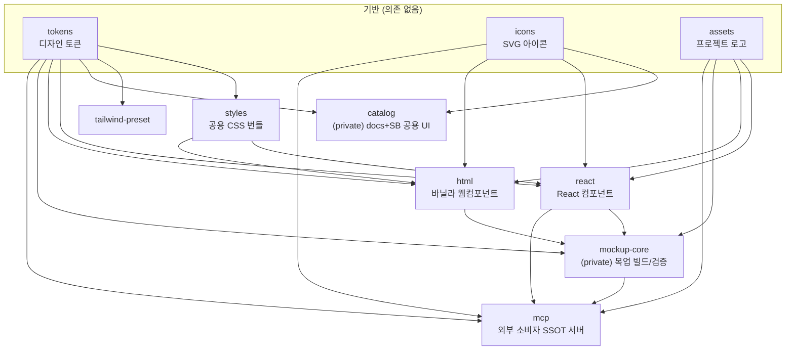

# 아키텍처

이 레포가 **어떻게 구성돼 있고, 왜 그렇게 나뉘었는지**를 한 장으로 설명합니다.
처음 오셨다면 [ONBOARDING.md](ONBOARDING.md) → 이 문서 → [GLOSSARY.md](GLOSSARY.md) 순서를 권합니다.

---

## 한 문장 요약

> **이 레포는 "디자인 시스템을 *만드는* 곳"입니다.** 5개 프로젝트(Trost · Geniet · NudgeEAP · CashwalkBiz · Runmile)가 공유하는 토큰·컴포넌트·아이콘을 한곳에서 정의하고, 외부 프로덕트/목업 앱은 이걸 **npm 패키지 + MCP 가이드**로 *소비*만 합니다.

핵심 설계 원칙은 **SSOT(Single Source of Truth)** — 같은 정보(색, 컴포넌트 props, 사용 규칙)는 한 곳에서만 정의하고 나머지는 거기서 파생됩니다. 그래서 이 레포에는 "직접 고치는 파일"과 "생성되는 파일(생성물)"이 섞여 있습니다. ([생성물](#생성물-generated-artifacts) 절 참고)

---

## 패키지 의존 그래프


*한눈 개요 — 위에서 아래로 빌드·의존 순서. 아래 mermaid 는 정확한 패키지별 의존 간선입니다.*



> 화살표 = import 방향. `tokens`/`icons`/`assets`는 아무것도 의존하지 않는 **기반(base)** 이라 가장 먼저 빌드됩니다.

### 패키지별 한 줄 역할

| 패키지 | 배포 | 역할 | 의존 |
|---|---|---|---|
| **tokens** | npm | 색·타이포·spacing·radius·motion 토큰 (TS export + CSS 변수) | — |
| **icons** | npm | Figma 기준 SVG 아이콘 → React/vanilla 컴포넌트 | — |
| **assets** | npm | 프로젝트 로고 등 래스터/벡터 에셋 (프로젝트 스왑 인터페이스) | — |
| **styles** | npm | react/html 이 **공유하는 CSS 번들** (토큰 참조) | tokens |
| **tailwind-preset** | npm | 토큰 기반 Tailwind theme preset | tokens |
| **react** | npm | React 컴포넌트 (~111종) — Props 의 SSOT | tokens·icons·styles·assets |
| **html** | npm | 바닐라 웹컴포넌트(`nds-*`) — react 의 프레임워크 무관 미러 | tokens·icons·styles·assets |
| **catalog** | 내부 | docs 사이트 + Storybook 이 공유하는 카탈로그 UI | tokens·icons |
| **mockup-core** | 내부 | 목업 빌드/검증 코어 (MCP·데스크탑 공용) | tokens·assets·react·html |
| **mcp** | MCPB | **외부 소비자에게 가이드·게이트를 강제하는 SSOT 서버** | tokens·icons·assets·react·mockup-core |

**빌드 순서** (`pnpm build` 가 turbo 로 자동 정렬): `tokens·icons·assets` → `styles·tailwind-preset·catalog` → `react·html` → `mockup-core` → `mcp`. 그래서 컴포넌트를 만지기 전에 **`pnpm build --filter @nudge-design/tokens`** 가 필요합니다(react 가 tokens 빌드 산출물을 import).

---

## 3면 미러 (react · styles · html)

같은 컴포넌트가 **세 패키지에 거울처럼** 존재합니다. 이게 이 레포에서 가장 헷갈리는 지점이라 먼저 짚습니다.

```
packages/react/src/Button.tsx        ← React 구현 + Props (SSOT)
packages/styles/src/Button.ts        ← CSS (react·html 공용, 토큰 참조)
packages/html/src/components/nds-button.ts  ← 바닐라 웹컴포넌트 (react 미러)
```

- **Props/enum 의 SSOT 는 react** — `styles`/`html` 은 react 를 따라갑니다.
- **CSS 는 styles 한 곳** — react 와 html 이 같은 스타일시트를 쓰므로 둘의 치수가 어긋날 수 없습니다.
- react 만 고치고 html 을 빠뜨리는 게 최대 사각지대라, **`pnpm lint:mirror-parity`** 게이트가 set/enum drift 를 차단합니다.

> 왜 둘 다? React 앱과 "프레임워크 없는 HTML 목업/이메일" 양쪽을 지원하기 위해서입니다. 단면만 제공하는 예외는 `scripts/mirror-parity-baseline.json` 에 사유와 함께 박제됩니다.

---

## 프로젝트는 토큰으로만 (`projects/*`)

프로젝트 차이(색·radius 등)는 **컴포넌트가 모릅니다.** 컴포넌트는 시멘틱 토큰 하나를 참조하고, 프로젝트 토큰 파일이 그 **값만 덮어씁니다.**

```
packages/tokens/src/projects/{trost,geniet,nudge-eap,cashwalk-biz,runmile}.ts
```

- 컴포넌트 CSS 에 `[data-project="..."]` 색 분기를 박지 않습니다 → 프로젝트별 차이는 토큰 값 override 로 흘려보냅니다.
- 모든 base 시멘틱 leaf 는 5개 프로젝트에 **명시 정의 or waiver** 여야 합니다 (`pnpm lint:project-completeness` 게이트 — base 색이 프로젝트 화면에 새는 버그 차단).

자세한 규칙·마이그레이션 패턴은 [CLAUDE.md](CLAUDE.md) "프로젝트 차이는 토큰으로만" 절이 SSOT 입니다.

---

## 생성물 (generated artifacts)

이 레포의 상당수 파일은 **직접 고치는 게 아니라 생성됩니다.** 소스를 고친 뒤 재생성을 빠뜨리고 커밋하면 CI 가 깨지는 게 최다 실패 원인입니다.

| 생성물 | 무엇에서 생성 | 재생성 |
|---|---|---|
| `packages/styles/dist/styles.css` | 각 `styles/src/*.ts` 의 `xxxStyles` 리터럴 | tokens·styles 빌드 |
| `packages/html/src/generated/component-attrs.*` | react Props → catalog.json | `generate:attrs` |
| `packages/mcp/catalog.json` | react dist + html src | mcp `build:manifest` |
| `packages/mcp/src/guides.generated.ts` | `guides-src/**/*.md` | mcp `build:guides` |
| `metadata/*` (componentGuides·coverage-manifest 등) | 소스 스캔 | 각 generate 스크립트 |
| `AGENTS.md` | `CLAUDE.md` | `sync:agents-md` |
| `.agents/skills/*` | `.claude/skills/*` | `sync:skills` |

**→ 커밋 전 `pnpm fix` 한 번이면 전부 올바른 순서로 재생성됩니다.** 출력된 "재생성된 파일" 목록을 변경분과 같이 커밋하세요. ([CONTRIBUTING.md](CONTRIBUTING.md) 참고)

---

## MCP 의 역할 (외부 소비자 경계)

외부 프로덕트/목업 앱은 이 레포의 소스를 보지 않습니다. 대신 **`@nudge-design/mcp` 서버**가:

- 컴포넌트/패턴/원칙 **가이드**(props 함정 포함)를 제공하고,
- 목업을 **검증**(`validate_html_mockup`·`score_mockup_quality`)하고,
- 외부 프로젝트의 `CLAUDE.md` 본문까지 발행합니다.

즉 **DS 사용 규칙의 SSOT 는 MCP** 입니다. 이 레포의 `CLAUDE.md` 에는 사용 규칙을 중복 작성하지 않고, 규칙을 바꾸려면 `packages/mcp/guides-src/**` 와 `packages/mcp/src/tools/guides.ts` 를 고칩니다. (배포는 `/ds-release` → MCPB)

---

## apps/ (내부 검수·배포)

| 앱 | 용도 |
|---|---|
| `apps/storybook` | 컴포넌트 데모 + 프로젝트 목업 (개발 중 시각 확인) |
| `apps/docs` | Docusaurus 문서 사이트 (`docs/` 소스 빌드, 컴포넌트 119+ 페이지) |
| `apps/web-server` | 배포용 서버 (랜딩 + docs + storybook 묶음) |
| `apps/desktop` | 데스크탑 카탈로그 (mockup-core 소비) |

이 앱들은 **DS 를 소비할 뿐 npm 으로 배포되지 않습니다.**

---

## 변경할 때 어디부터?

| 하고 싶은 것 | 시작 지점 | 스킬 |
|---|---|---|
| 새 컴포넌트 | `packages/react/src/` → styles → html → 스토리 → MCP 가이드 | `/ds-component` |
| 토큰 추가/수정 | `packages/tokens/src/` + `DESIGN.md` | — |
| 프로젝트 색 차이 | `packages/tokens/src/projects/<project>.ts` (컴포넌트 X) | — |
| 목업 피드백 반영 | DS 컴포넌트/토큰/가이드 트리아지 | `/ds-fix` |
| 정합성 감사 | 3면 미러·전파·토큰·figma sync 점검 | `/ds-audit` |
| 외부 배포 | changeset → MCPB | `/ds-release` |

> 실제 절차/게이트의 SSOT 는 [CLAUDE.md](CLAUDE.md) 와 각 `.claude/skills/*/SKILL.md` 입니다. 이 문서는 *지도*, 그쪽이 *규칙서* 입니다.
