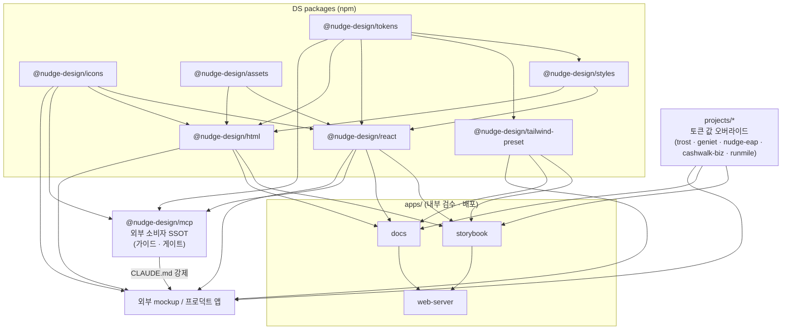
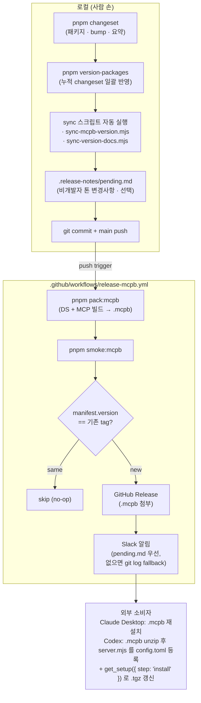
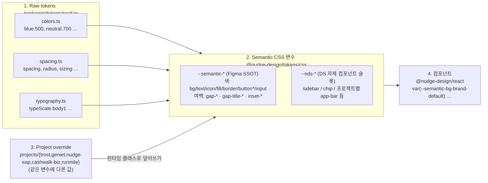
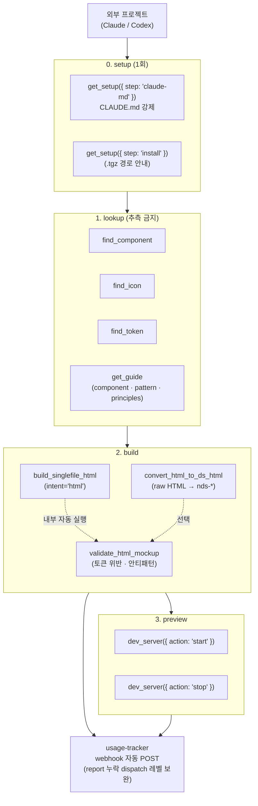

# Nudge Design System

5개 프로젝트(**Trost · Geniet · NudgeEAP · CashwalkBiz · Runmile**)가 공유하는 디자인 토큰, React 컴포넌트, 바닐라 웹컴포넌트, 아이콘, Storybook, 문서를 관리하는 모노레포입니다.

> **처음 오셨나요?** → [ONBOARDING.md](ONBOARDING.md) (역할별 시작) · [ARCHITECTURE.md](ARCHITECTURE.md) (구조·패키지 그래프) · [GLOSSARY.md](GLOSSARY.md) (용어) · [CONTRIBUTING.md](CONTRIBUTING.md) (기여 플로우) · [GOVERNANCE.md](GOVERNANCE.md) (운영·확장·개선 규칙)

## 배포 사이트

| 경로                                                                                                  | 설명                                    |
| ----------------------------------------------------------------------------------------------------- | --------------------------------------- |
| [/](http://nudge-design-system.eba-afhh232q.ap-northeast-2.elasticbeanstalk.com/)                     | 랜딩 페이지 (Docs / Storybook 바로가기) |
| [/docs/](http://nudge-design-system.eba-afhh232q.ap-northeast-2.elasticbeanstalk.com/docs/)           | Docusaurus 문서 사이트                  |
| [/storybook/](http://nudge-design-system.eba-afhh232q.ap-northeast-2.elasticbeanstalk.com/storybook/) | Storybook 컴포넌트                      |

## Packages

각 패키지의 상세는 해당 `README.md`, 의존 그래프·빌드 순서는 [ARCHITECTURE.md](ARCHITECTURE.md) 참고.

| 패키지 | 배포 | 설명 |
| --- | --- | --- |
| [`@nudge-design/tokens`](packages/tokens) | npm | 색·타이포·spacing·radius·motion 토큰 (TS export + CSS 변수) |
| [`@nudge-design/icons`](packages/icons) | npm | Figma 기준 SVG 아이콘. `currentColor` + `size`/`color` prop |
| [`@nudge-design/assets`](packages/assets) | npm | 프로젝트 로고 등 자산 SSOT (프로젝트 스왑 인터페이스) |
| [`@nudge-design/styles`](packages/styles) | npm | react·html 공용 CSS 번들 (토큰 참조) |
| [`@nudge-design/react`](packages/react) | npm | React 컴포넌트 (~111종) — Props 의 SSOT |
| [`@nudge-design/html`](packages/html) | npm | 바닐라 웹컴포넌트(`nds-*`) — react 미러 |
| [`@nudge-design/tailwind-preset`](packages/tailwind-preset) | npm | 토큰 기반 Tailwind theme preset |
| [`@nudge-design/mcp`](packages/mcp) | MCPB | 외부 소비자에게 가이드·게이트를 강제하는 SSOT 서버 |
| [`@nudge-design/mockup-core`](packages/mockup-core) | 내부 | 목업 빌드/검증 코어 (MCP·데스크탑 공용) |
| [`@nudge-design/catalog`](packages/catalog) | 내부 | docs·Storybook 공용 카탈로그 UI |

## 프로젝트 구조



> 화살표는 import / 제공 방향. `projects/*`는 토큰 값 오버라이드 레이어로 같은 시멘틱 변수에 다른 값을 주입하고, `@nudge-design/mcp`는 토큰·컴포넌트·아이콘 카탈로그 + 사용 규칙을 외부 소비자에게 강제하는 SSOT 입니다. **전체 10개 패키지 그래프·빌드 순서는 [ARCHITECTURE.md](ARCHITECTURE.md).**

```text
NudgeEAPDesignSystem
├─ apps
│  ├─ docs              # Docusaurus 문서 사이트
│  ├─ storybook         # Storybook (컴포넌트 + 프로젝트 목업)
│  ├─ web-server        # 배포용 서버 (랜딩 + docs + storybook)
│  └─ desktop           # 데스크탑 카탈로그
├─ packages
│  ├─ tokens            # 디자인 토큰 (기반)
│  ├─ icons             # 아이콘 (기반)
│  ├─ assets            # 프로젝트 로고/자산 (기반)
│  ├─ styles            # react·html 공용 CSS 번들
│  ├─ react             # React 컴포넌트 (Props SSOT)
│  ├─ html              # 바닐라 웹컴포넌트 (react 미러)
│  ├─ tailwind-preset   # Tailwind preset
│  ├─ mcp               # MCP 서버 (외부 소비자 SSOT)
│  ├─ mockup-core       # 목업 빌드/검증 코어 (내부)
│  └─ catalog           # docs·SB 공용 카탈로그 UI (내부)
├─ projects               # 프로젝트별 설정
├─ docs                 # 문서 소스 (Docusaurus)
├─ harness              # 하네스 파이프라인 프롬프트
├─ metadata             # Figma 연결 메타데이터
├─ mockups              # 목업 산출물
└─ scripts              # 유틸리티 스크립트
```

## 시작하기

```bash
# 요구 사항: Node.js 24.x, pnpm 9.x

pnpm install          # 의존성 설치
pnpm build            # 전체 빌드
pnpm storybook        # Storybook 실행 (localhost:6006)
pnpm docs:dev         # Docs 실행 (localhost:3001)
```

## 주요 명령어

```bash
pnpm build                          # 전체 빌드
pnpm dev                            # 전체 dev
pnpm lint                           # 전체 lint (sync-mcpb-version --check 포함)
pnpm typecheck                      # 전체 타입 체크
pnpm test                           # 전체 테스트
pnpm --filter @nudge-design/tokens build   # 토큰만 빌드
pnpm --filter @nudge-design/icons build    # 아이콘 생성 + 빌드
pnpm generate:project-coverage            # 프로젝트별 컴포넌트 커버리지 재생성
```

### 버전 / 릴리즈 (Changesets)

DS 패키지 (`@nudge-design/{react,tokens,icons,tailwind-preset}`) 변경은 Changesets 로 관리합니다.

```bash
pnpm changeset           # 변경 기록 작성 (영향받는 패키지 + bump 레벨 + 요약)
pnpm version-packages    # 누적 changeset 일괄 반영 + manifest.json/docs 버전표 자동 동기화
# → 커밋 + main push 만 하면 release-mcpb.yml 가 .mcpb 빌드/릴리즈/슬랙 알림까지 자동 처리
```



> 사람이 만지는 건 `pnpm changeset` 과 `.release-notes/pending.md` 정도. 나머지(버전 sync · 빌드 · 태깅 · 릴리즈 · 슬랙)는 CI 가 처리하고, CI 는 `.release-notes/pending.md` 를 **read-only** 로만 사용합니다.

상세 흐름은 [`packages/mcp/README.md` — 버전 / 외부 배포 흐름](./packages/mcp/README.md#버전--외부-배포-흐름) 참조.

## 사용 예시

```tsx
// 컴포넌트
import { Button, Card, Tabs } from "@nudge-design/react";

// 아이콘
import { SearchIcon, ChevronRightIcon } from "@nudge-design/icons";

// 토큰
import { semantic, spacing, typeScale } from "@nudge-design/tokens";
import "@nudge-design/tokens/css"; // CSS 변수

// Tailwind preset
import { nudgeEapPreset } from "@nudge-design/tailwind-preset";
```

## 멀티 프로젝트

5개 프로젝트를 CSS 변수 오버라이드로 지원합니다. Storybook 툴바에서 프로젝트를 전환하면 동일 컴포넌트가 프로젝트별 스타일로 렌더링됩니다.

- **NudgeEAP** (블루) — 기본 토큰, 기업 EAP 멘탈케어
- **Trost** (옐로우) — 심리 상담 플랫폼
- **Geniet** (틸) — 건강 관리 + 리워드 커머스
- **CashwalkBiz** (옐로우) — 캐시워크 포 비즈니스(B2B)
- **Runmile** (오렌지) — 러닝 대회 + 커뮤니티 + 마이러닝 기록



> 컴포넌트는 raw hex 도 raw TS 토큰도 아니라 **시멘틱 CSS 변수만** 읽습니다. 프로젝트 전환은 시멘틱 변수 값만 갈아끼우면 되고, 새 프로젝트를 추가해도 컴포넌트 코드는 그대로입니다.

## Storybook 도구

Storybook 하단 패널에서 사용할 수 있는 도구:

- **토큰 에디터** — 프로젝트별 CSS 변수를 실시간 편집
- **스펙 오버레이** — hover 시 요소의 크기, 폰트, 색상, 패딩 등 CSS 스펙 표시
- **CSS 편집기** — 요소 선택 후 스타일 직접 수정, undo/redo, 디자인 리포트 생성
- **HTML/PNG 내보내기** — 목업을 standalone HTML 또는 PNG 스크린샷으로 저장

## MCP 목업 가드레일

`@nudge-design/mcp`는 외부 목업 프로젝트에서 Claude/Codex가 DS 컴포넌트, 아이콘, 토큰, UX 패턴 기준을 조회하도록 돕습니다.



> `build_singlefile_html(intent='html')` 한 번 호출이면 **변환 · 검증 · 사용량 보고가 자동으로 묶입니다.** 사람(LLM)이 직접 부르는 건 lookup 도구 정도이고, 가드레일은 dispatch 레벨에서 강제됩니다.

- `get_guide({ topic: 'component:<Name>' })`: Button/Chip/Select 등 컴포넌트별 사용 함정 확인
- `get_guide({ topic: 'pattern:<name>' })`: CTA 그룹, 안내문 강조, 드롭다운, 고밀도 리스트 배치 기준 확인
- `validate_html_mockup`: 토큰 위반뿐 아니라 화살표 CTA 남발, primary CTA 과다, Chip/Badge 장식 사용, 강조 과잉까지 검증 (`build_singlefile_html` 빌드 시 자동 실행)
- **사용량 추적 가드레일**: DS 사용량 리포트는 `validate_html_mockup`(report 기본 true) · `build_singlefile_html`(자동)에 흡수됐고, 옛 `report_mockup_usage` 단독 도구는 없어졌습니다 — dispatch 레벨에서 펜딩 목업을 자동 리포트하고 그 외 도구는 응답에 펜딩 경고를 인젝션 (`packages/mcp/README.md` 의 "사용량 추적 가드레일" 참조)

## 문서

| 문서                                                            | 설명                               |
| --------------------------------------------------------------- | ---------------------------------- |
| [TOKENS.md](./docs/TOKENS.md)                                   | Figma 기준 토큰 정의               |
| [semantic-tokens.md](./docs/semantic-tokens.md)                 | 시멘틱 토큰 카탈로그 (자동 생성)   |
| [FIGMA_TO_REACT_WORKFLOW.md](./docs/FIGMA_TO_REACT_WORKFLOW.md) | Figma -> React 반자동화 워크플로우 |
| [STYLING_STRUCTURE_GUIDE.md](./docs/STYLING_STRUCTURE_GUIDE.md) | 스타일 확장 구조 가이드            |

## CI

GitHub Actions로 lint, typecheck, test, build, Storybook build, 접근성 검사를 자동 실행합니다. Chromatic 시각 회귀 테스트는 `CHROMATIC_PROJECT_TOKEN` 설정 시 활성화됩니다.
