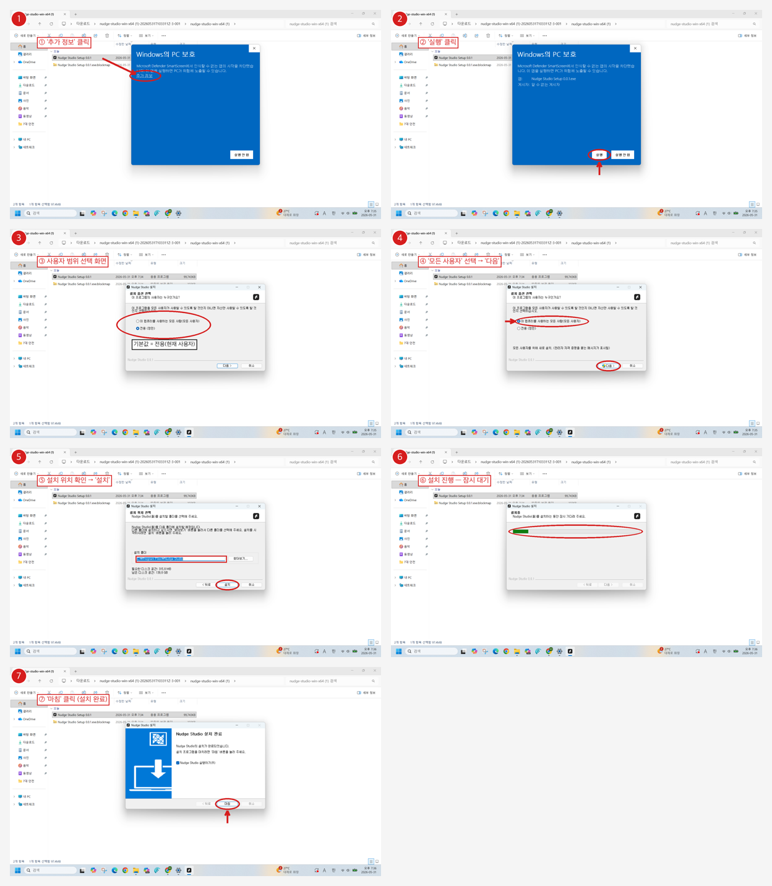
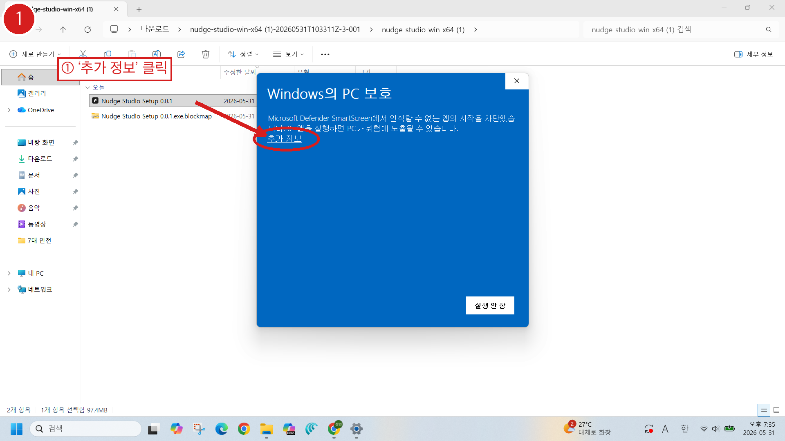
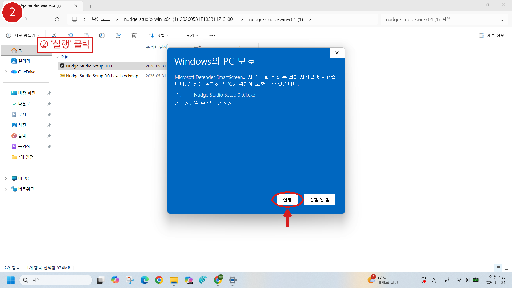
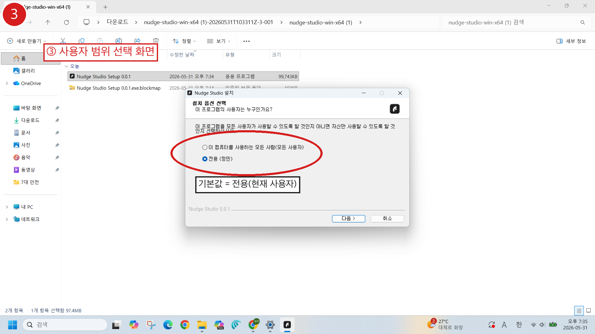
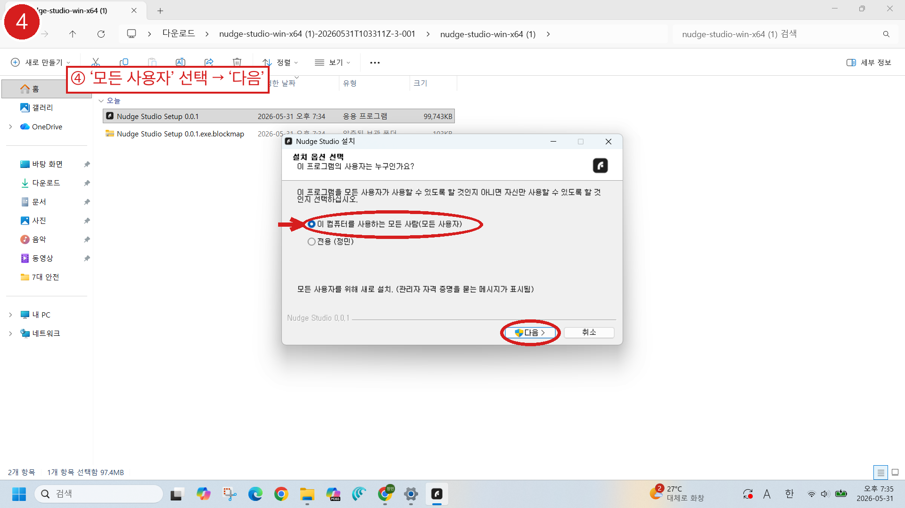
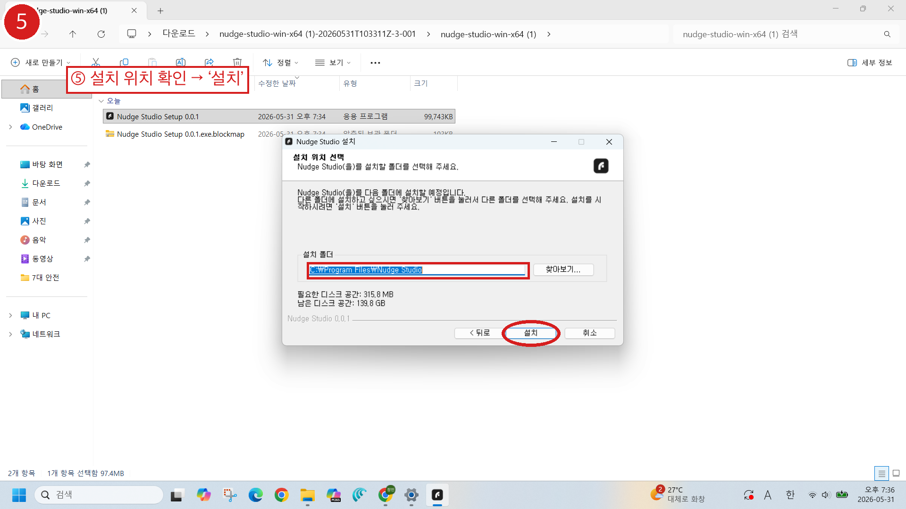
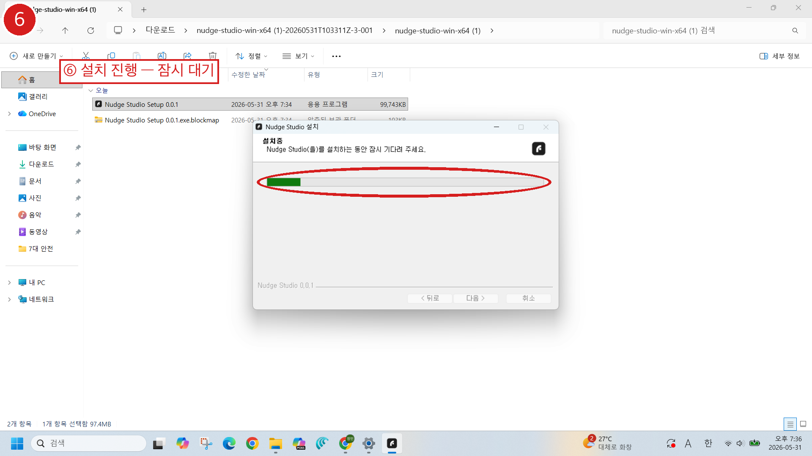
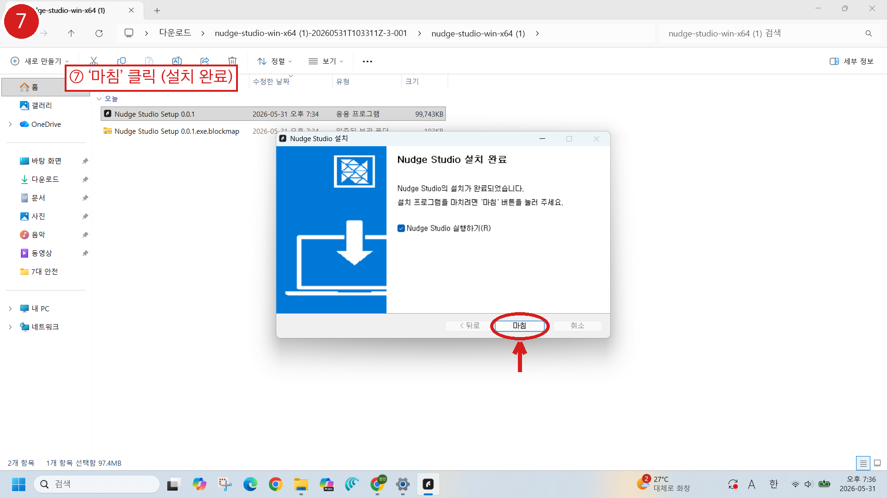

# Nudge Studio 설치 가이드 (Windows x64)

`Nudge Studio Setup 0.0.1.exe` 를 처음 설치할 때 나오는 화면 순서입니다.
Microsoft Defender SmartScreen 경고 → 설치 옵션 → 완료까지 **7단계**.

> 설치 파일: `Nudge Studio Setup 0.0.1.exe` (다운로드 폴더, 약 97.4 MB)
> 게시자 서명이 없어 SmartScreen 경고가 뜨는 건 **정상**입니다. (1~2단계에서 직접 허용)

전체 흐름 한눈에 보기:

---

## ① SmartScreen 차단 — `추가 정보` 클릭

설치 파일을 더블클릭하면 **"Windows의 PC 보호"** 파란 화면이 뜹니다.

> Microsoft Defender SmartScreen에서 인식할 수 없는 앱의 시작을 차단했습니다.

이 화면에는 `실행 안 함` 버튼만 보입니다. 왼쪽의 **`추가 정보`** 링크를 클릭하세요.

---

## ② SmartScreen — `실행` 클릭

`추가 정보`를 누르면 앱 정보가 펼쳐집니다.

- 앱: `Nudge Studio Setup 0.0.1.exe`
- 게시자: `알 수 없는 게시자`

새로 생긴 **`실행`** 버튼을 클릭합니다.

---

## ③ 설치 옵션 선택 — 사용자 범위 (화면 등장)

Nudge Studio 설치 마법사가 열립니다. **"이 프로그램의 사용자는 누구인가요?"**

- ○ 이 컴퓨터를 사용하는 모든 사람 (모든 사용자)
- ● **전용 (현재 사용자)** ← 기본 선택값

---

## ④ `모든 사용자` 선택 → `다음`

**`이 컴퓨터를 사용하는 모든 사람(모든 사용자)`** 으로 변경한 뒤 **`다음`** 을 누릅니다.

> 모든 사용자를 위해 새로 설치. (관리자 자격 증명을 묻는 메시지가 표시될 수 있음)

> 💡 현재 사용자만 쓸 거라면 ③의 기본값 `전용`을 그대로 두고 `다음`을 눌러도 됩니다.
> 그 경우 설치 경로가 `C:\Users\...\AppData\Local` 아래로 바뀝니다.

---

## ⑤ 설치 위치 확인 → `설치`

설치 폴더를 확인합니다.

- 설치 폴더: `C:\Program Files\Nudge Studio`
- 필요한 디스크 공간: 315.8 MB / 남은 공간: 139.8 GB

경로를 바꾸려면 `찾아보기...`, 그대로 진행하려면 **`설치`** 를 누릅니다.

---

## ⑥ 설치 진행 — 잠시 대기

> Nudge Studio을(를) 설치하는 동안 잠시 기다려 주세요.

진행 바가 끝까지 찰 때까지 기다립니다.

---

## ⑦ 설치 완료 — `마침`

> Nudge Studio의 설치가 완료되었습니다.

`Nudge Studio 실행하기` 체크 상태에서 **`마침`** 을 누르면 설치가 끝나고 앱이 실행됩니다.

---

### 요약

| 단계 | 화면 | 클릭 |
|:---:|:---|:---|
| 1 | SmartScreen 차단 | `추가 정보` |
| 2 | SmartScreen 펼침 | `실행` |
| 3 | 사용자 범위 (등장) | — |
| 4 | 사용자 범위 선택 | `모든 사용자` → `다음` |
| 5 | 설치 위치 | `설치` |
| 6 | 설치 진행 | (대기) |
| 7 | 설치 완료 | `마침` |

> 원본: Figma `제목 없음` 파일, Page 28 (node `499:945`) / 노드 `499:950`~`499:956`
